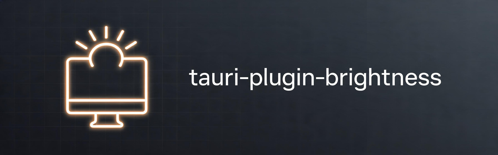

<div align="center">



**Control display brightness from a Tauri application.**

DDC/CI for external monitors, `ddcutil` for NVIDIA and docks, kernel backlight
for internal laptop panels.

[](https://crates.io/crates/tauri-plugin-brightness)
[](https://www.npmjs.com/package/tauri-plugin-brightness-api)
[](https://github.com/marrionesa/tauri-plugin-brightness/actions/workflows/ci.yml)
[](#license)
[](https://v2.tauri.app)

</div>

> **This plugin is not officially approved by the Tauri Programme.** It follows
> the Tauri plugin conventions, so it can be adopted upstream, but only
> codebases inside the [`tauri-apps`](https://github.com/tauri-apps) GitHub
> organisation are official. TAURI is a trademark of The Tauri Programme within
> the Commons Conservancy.

## Contents

- [Why two crates](#why-two-crates)
- [Install](#install)
- [Backends](#backends)
- [Platform support](#platform-support)
- [Linux permissions](#linux-permissions)
- [Documentation](#documentation)
- [Development](#development)
- [Contributing](#contributing)
- [License](#license)

## Why two crates

Brightness control is useful outside a webview, so the engine is published on its
own and the plugin is a thin layer over it:

| Crate | What it is |
| --- | --- |
| [`tauri-brightness-core`](crates/tauri-brightness-core) | The engine. No Tauri, no GUI toolkit. Use it from any Rust program. |
| [`tauri-plugin-brightness`](crates/tauri-plugin-brightness) | The Tauri 2 plugin: commands, permissions, Rust API. |
| [`tauri-plugin-brightness-api`](crates/tauri-plugin-brightness/guest-js) | Typed JavaScript bindings. |
| [`examples/tauri-app`](crates/tauri-plugin-brightness/examples/tauri-app) | Tray application that uses every feature, including the diagnostic panel. |

## Install

```sh
cargo add tauri-plugin-brightness
npm add tauri-plugin-brightness-api
```

Register the plugin and allow its commands:

```rust
// src-tauri/src/lib.rs
tauri::Builder::default()
    .plugin(tauri_plugin_brightness::init())
    .run(tauri::generate_context!())
    .expect("error while running tauri application");
```

```json
// src-tauri/capabilities/default.json
{ "permissions": ["brightness:default"] }
```

Then use it from the frontend:

```typescript
import {
  diagnose,
  listMonitors,
  setBrightness
} from 'tauri-plugin-brightness-api'

const monitors = await listMonitors()

for (const monitor of monitors) {
  console.log(`${monitor.name}: ${monitor.brightness}/${monitor.max}`)
}

if (monitors.length === 0) {
  // Explains which permission is missing instead of failing silently.
  const report = await diagnose()
  console.warn(report.suggestions.join('\n'))
} else {
  await setBrightness(monitors[0].id, 50)
}
```

The full reference, including the Rust API, the permission list and the
troubleshooting guide, is in the [plugin README](crates/tauri-plugin-brightness).

## Backends

Three backends are tried in order, and the display identifiers say which one
handled each monitor:

1. **DDC/CI over I2C** through the pure Rust
   [`ddc-hi`](https://crates.io/crates/ddc-hi) crate. Fast, in process, and the
   default choice.
2. **`ddcutil`**, the standard Linux DDC/CI tool. Slower, but it is the only
   backend that works with the NVIDIA proprietary driver, USB-C docks and
   DisplayLink adapters.
3. **Kernel backlight** at `/sys/class/backlight`. Internal laptop panels are not
   DDC/CI devices, so they are always enumerated in addition to the others.

## Platform support

| Platform | Supported | Notes |
| --- | --- | --- |
| Linux | ✓ | DDC/CI, `ddcutil` and kernel backlight |
| Windows | Partial | DDC/CI through the Windows API backend of `ddc-hi` |
| macOS | Partial | DDC/CI through the macOS backend of `ddc-hi` |
| Android | ✗ | Not a desktop concept |
| iOS | ✗ | Not a desktop concept |

## Linux permissions

External monitors need I2C access; internal panels do not.

```sh
sudo modprobe i2c-dev
sudo usermod -aG i2c "$USER"   # then log out and back in
sudo apt install ddcutil       # optional but recommended
```

If no display is detected, the `diagnose` command reports which of these is
missing and prints the command to fix it. The example application shows this in
a panel instead of a slider that does nothing.

## Documentation

| Document | Read it when |
| --- | --- |
| [Plugin reference](crates/tauri-plugin-brightness/README.md) | Using the plugin: every command, the permission list, and troubleshooting |
| [Engine reference](crates/tauri-brightness-core/README.md) | Using the brightness control outside Tauri |
| [Example application](crates/tauri-plugin-brightness/examples/tauri-app/README.md) | Seeing a full tray app built with the plugin |
| [docs/](docs/) | The project's place in the Tauri ecosystem |
| [SECURITY.md](SECURITY.md) | Reporting a vulnerability, and the fixed ones |
| [CHANGELOG.md](CHANGELOG.md) | What changed in each release |

## Contributing

Contributions are welcome. The example application doubles as the integration
test, and hardware behaviour cannot be covered by unit tests, so please say which
monitor and desktop environment you tested against.

```sh
cargo test --workspace
cargo clippy --workspace --all-targets -- -D warnings
```

See [CONTRIBUTING.md](CONTRIBUTING.md) for the repository layout and the testing
expectations, and [CODE_OF_CONDUCT.md](CODE_OF_CONDUCT.md) for the community
guidelines.

## Development

The workspace needs Rust **1.90** or newer, driven by `tauri` 2.12.

```sh
cargo test --workspace
cargo clippy --workspace --all-targets

cd crates/tauri-plugin-brightness/examples/tauri-app
npm install && npm run dev
```

See [CONTRIBUTING.md](CONTRIBUTING.md) for the layout and the testing
expectations, and [docs/](docs/) for the project's place in the Tauri
ecosystem.

## License

Licensed under either of [Apache License, Version 2.0](LICENSE-APACHE) or
[MIT license](LICENSE-MIT), at your option.
