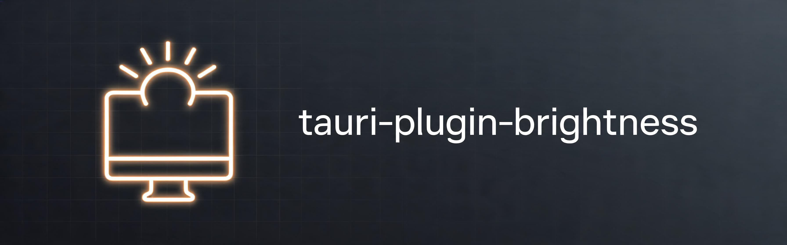

Control display brightness through DDC/CI and the Linux kernel backlight.

| Platform | Supported |
| -------- | --------- |
| Linux    | ✓         |
| Windows  | Partial   |
| macOS    | Partial   |
| Android  | ✗         |
| iOS      | ✗         |

This plugin is **not officially approved by the Tauri Programme**. It follows
the Tauri plugin conventions, so it can be adopted upstream, but only codebases
inside the [`tauri-apps`](https://github.com/tauri-apps) GitHub organisation are
official.

## Install

_This plugin requires a Rust version of at least **1.90**_

There are three general methods of installation that we can recommend.

1. Use crates.io and npm (easiest, and requires you to trust that our publishing
   pipeline worked)
2. Pull sources directly from GitHub using git tags / revision hashes (most
   secure)
3. Git submodule install this repo in your Tauri project and then use file
   protocol to ingest the source (most secure, but inconvenient to use)

Install the Core plugin by adding the following to your `Cargo.toml` file:

`src-tauri/Cargo.toml`

```toml
[dependencies]
tauri-plugin-brightness = "0.1.0"
# alternatively with Git:
tauri-plugin-brightness = { git = "https://github.com/marrionesa/tauri-plugin-brightness" }
```

You can install the JavaScript Guest bindings using your preferred JavaScript
package manager:

```sh
pnpm add tauri-plugin-brightness-api
# or
npm add tauri-plugin-brightness-api
# or
yarn add tauri-plugin-brightness-api
```

## Usage

First you need to register the core plugin with Tauri:

`src-tauri/src/lib.rs`

```rust
fn main() {
    tauri::Builder::default()
        .plugin(tauri_plugin_brightness::init())
        .run(tauri::generate_context!())
        .expect("error while running tauri application");
}
```

Then grant the commands to your window. The default permission set allows all of
them:

`src-tauri/capabilities/default.json`

```json
{
  "permissions": ["brightness:default"]
}
```

Afterwards all the plugin's APIs are available through the JavaScript guest
bindings:

```typescript
import {
  diagnose,
  listMonitors,
  setBrightness
} from 'tauri-plugin-brightness-api'

const monitors = await listMonitors()
for (const monitor of monitors) {
  console.log(`${monitor.name}: ${monitor.brightness}/${monitor.max}`)
}

await setBrightness(monitors[0].id, 50)

if (monitors.length === 0) {
  const report = await diagnose()
  console.warn(report.suggestions.join('\n'))
}
```

### Rust API

The same operations are available from Rust, without going through the webview,
through the `BrightnessExt` extension trait:

```rust
use tauri::Manager;
use tauri_plugin_brightness::BrightnessExt;

tauri::Builder::default()
    .plugin(tauri_plugin_brightness::init())
    .setup(|app| {
        for monitor in app.brightness().list_monitors() {
            println!("{} is at {}%", monitor.name, monitor.brightness_percent());
        }
        Ok(())
    });
```

### Display identifiers

A display is addressed by a string that stays valid for the lifetime of a boot.
The prefix says which backend drives it:

| Identifier | Backend |
| --- | --- |
| `ddc-0`, `ddc-1` | DDC/CI over I2C, in process |
| `ddcutil-1`, `ddcutil-2` | The `ddcutil` command line tool |
| `backlight-intel_backlight` | The Linux kernel backlight interface |

Always use the identifiers returned by `listMonitors()` rather than building
them yourself, because which backend wins depends on the machine.

### Brightness scale

Displays do not share a scale. `getBrightness` therefore reports the raw value,
the display maximum, and a `brightnessPercent` that is comparable across
displays. `setBrightness` expects the same scale the display reports.

## Permissions

The commands are not reachable from the webview until a capability allows them.
`brightness:default` allows every command; narrower sets are also available:

| Permission | Commands |
| --- | --- |
| `brightness:default` | All of the below |
| `brightness:allow-list-monitors` | `list_monitors` |
| `brightness:allow-get-brightness` | `get_brightness` |
| `brightness:allow-set-brightness` | `set_brightness` |
| `brightness:allow-diagnose` | `diagnose` |

Grant `brightness:allow-get-brightness` and
`brightness:allow-set-brightness` alone when the application should not be able
to enumerate the hardware, and `brightness:allow-diagnose` alone for a
troubleshooting screen.

## Linux permissions

External monitors are reached over `/dev/i2c-*`, which requires the `i2c-dev`
kernel module and usually membership of the `i2c` group:

```sh
sudo modprobe i2c-dev
sudo usermod -aG i2c "$USER"
```

Log out and back in after changing groups.

`ddcutil` is optional but recommended, because it handles NVIDIA proprietary
drivers, docks and USB-DDC monitors that the in-process backend cannot reach:

```sh
sudo apt install ddcutil
```

Internal laptop panels need none of this. They are controlled through the
`org.freedesktop.login1` D-Bus interface, the same path GNOME, KDE and COSMIC
use, which works without privileges.

When no display is detected, call the `diagnose` command: it reports which of
these pieces is missing and prints the exact command to run.

## Common issues

**The slider moves but the display does not change.** The monitor may reject
DDC/CI writes. Check that DDC/CI is enabled in the monitor's own on-screen menu,
then run `ddcutil detect` in a terminal. If it lists displays, the plugin works
with the same permissions.

**No displays are detected on NVIDIA.** The proprietary driver does not expose
standard I2C access. Install `ddcutil` and make sure the `i2c-dev` module is
loaded, then log out and back in.

**A display disappeared from the list.** Displays are re-enumerated on every
call, so unplugging a monitor removes it immediately. Plug it back in and call
`listMonitors()` again.

## Development

The example application in `examples/tauri-app` is a tray application that uses
every feature of the plugin, including the diagnostic panel:

```sh
cd examples/tauri-app
pnpm install
pnpm dev
```

## Contributing

Pull requests are welcome. The example application doubles as the integration
test, so please check it against a real display when touching a backend.

## License

Licensed under either of

- Apache License, Version 2.0
- MIT license

at your option.

TAURI is a trademark of The Tauri Programme within the Commons Conservancy.
<https://tauri.app>
